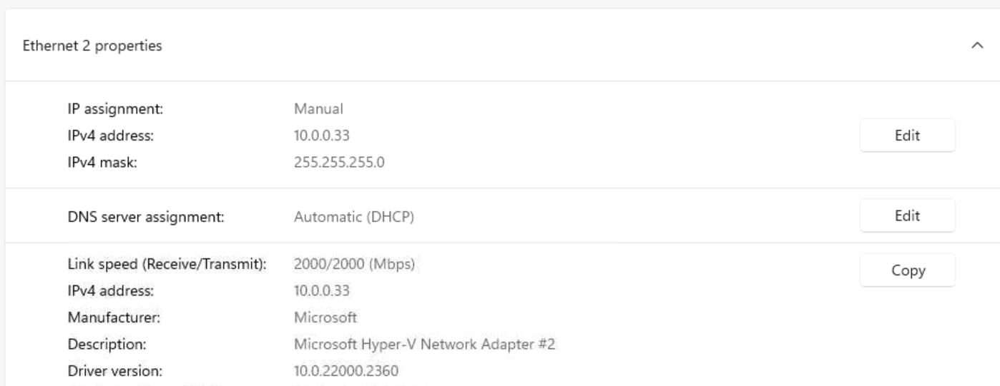
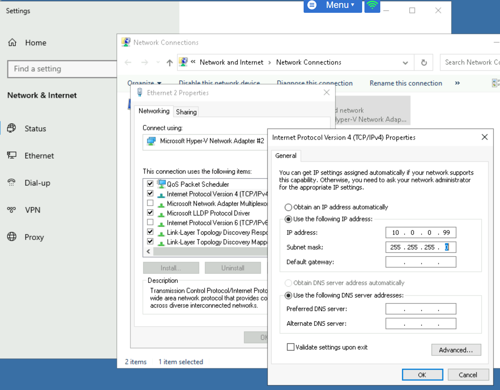
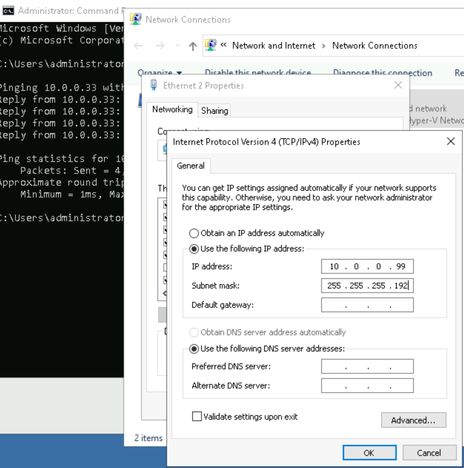
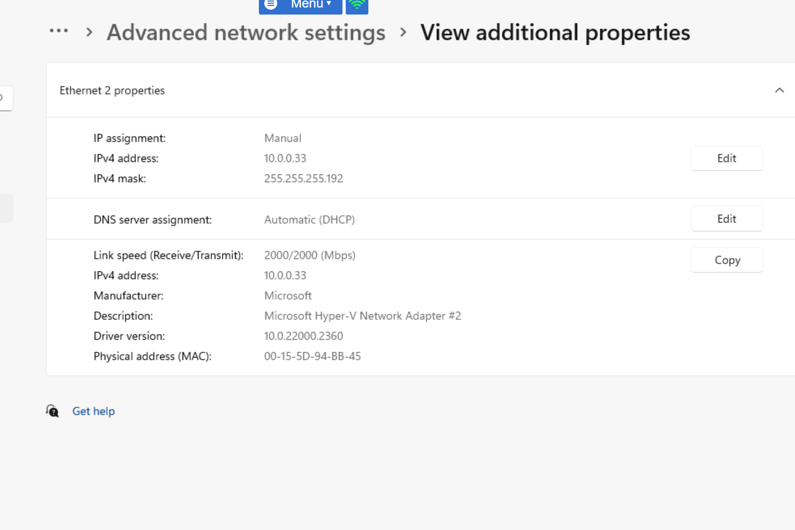
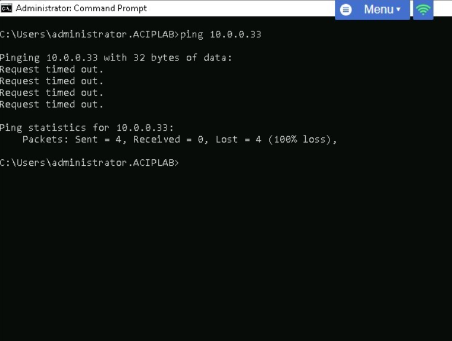

# Exercise 2 – Subnetting

## Objectives
- Assign static IP addresses
- Conduct subnetting

## Steps
1. Configure ACIWIN11 → `10.0.0.33/24`
2. Configure ACIDM01 → `10.0.0.99/24`
3. Ping test → success.
4. Change both subnet masks to `/26` (255.255.255.192).
5. Now they fall into different subnets (10.0.0.0/26 vs 10.0.0.64/26).
6. Ping test → fails.

## Evidence
- Screenshot:

## Reflection
Subnetting creates logical separation even within the same physical LAN.
