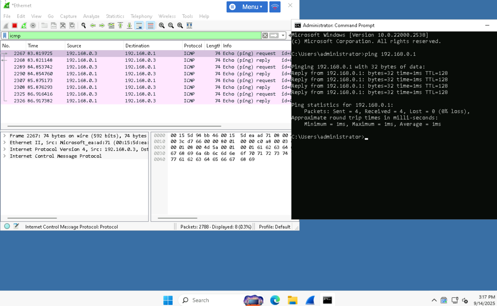
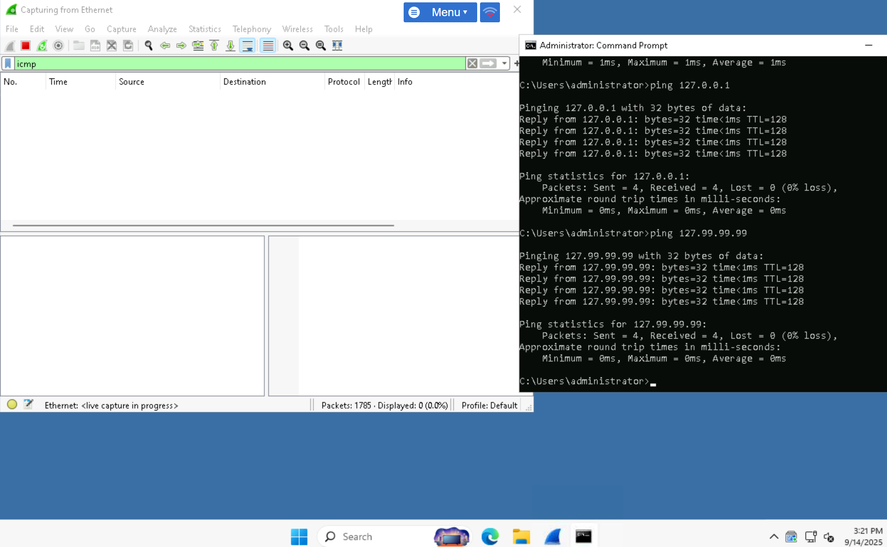

# Exercise 3 – Loopback Address

## Objectives
- Ping and articulate loopback address range

## Steps
1. Open Wireshark → filter `icmp`.
2. Ping `192.168.0.1` → packets visible in Wireshark.
3. Ping `127.0.0.1` → succeeds, but no packets captured (internal stack).
4. Ping `127.99.99.99` → also succeeds (part of 127.0.0.0/8).

## Evidence
- Screenshot: `../screenshots/loopback-ping.png`

## Reflection
Loopback traffic stays internal, validating the network stack without hitting the NIC.
